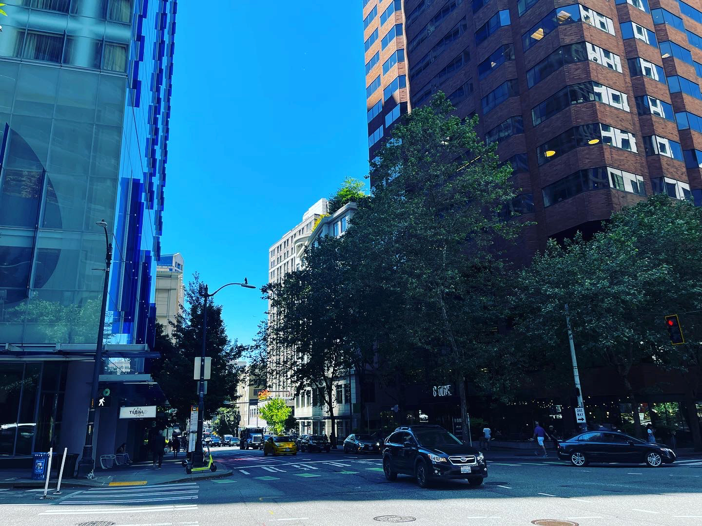

こんにちは、hpp([@hpp_ricecake](https://twitter.com/hpp_ricecake))です。
普段は大学院生として研究や趣味に勤しんでいます。

最近、自然言語処理分野の三大トップカンファレンスのうちの一つであるNAACL 2022(開催地: シアトル)に現地参加したのですが、
帰国前に現地でCOVID-19陽性と診断されてしまい、帰国に非常に苦労しました。

比較的珍しい体験かなと思い、記録を残しておけば誰か助かる人がいるかもしれないなと思ったので、今回はそのことについて書いてみます。

本記事は大まかに以下の流れで進みます。

1. 国際学会に現地参加した感想
2. COVID-19陽性と診断される前後の話
3. 帰国のための諸々

では、どうぞよろしくお願いいたします。

# 国際学会に現地参加した感想

まずは国際学会に現地参加したことについて書いていきます。
改めて書きますが、今回は自然言語処理分野のトップカンファレンスの一つである[NAACL 2022](https://2022.naacl.org)に参加しました。
といっても、NAACLは本会議の他に複数のワークショップが存在しており、今回は僕が発表したのは併設ワークショップの*SEM 2022というところです。
したがって本会議での発表はなかったのですが、研究を始めた学部4年生の時点でこのような社会情勢になっていたので、国際学会の現地参加は初めてであり、非常に刺激的な体験になりました。
発表した論文は以下です。

[Comparison and Combination of Sentence Embeddings Derived from Different Supervision Signals](https://aclanthology.org/2022.starsem-1.12/)

本記事では、論文の内容に詳しくは触れません(僕が専門としている文埋め込みの性質について考えてみた、という内容です)。
気になってくれた方がいれば、ぜひどこかで話しかけてください。
次節から、もう少し詳しく参加した感想について話していきます。

## 参加中の過ごし方

NAACL 2022はシアトル現地時間の7/10~7/15に開催されました。
日程としては、7/10にチュートリアル、7/11~7/13が本会議、7/14,15がワークショップという感じで、僕の発表は7/14の朝でした。
学会会場はシアトルにあるホテルで、いくつかあるホールが貸し切りになっていました。
ホテルには売店があったほか、朝ご飯として簡易的なビュッフェも提供されていました(なんというか、大雑把ではありましたが)。

学会会場でもあるホテルはかなり過ごしやすく、また学会のディスカウントにより安く宿泊することができました(通常1泊$450くらいのところ、$265程度になっていた)。
学会会場が宿泊地というのは非常に良くて、セッションを聞いて少し休憩しに自室に戻る、ということが簡単にできました。

僕が宿泊していた部屋は高層階だったので、非常に眺めが良く、慣れない海外生活での精神の安定に一役買ってくれました。

## 会場の様子

コロナ禍での学会現地参加ということで、自分自身、感染対策にはかなり気を配っていました。
幸い、学会運営側からマスク着用のアナウンスが出ていたので、マスクをしている参加者の比率は比較的高かったと思います。

今回のNAACLはハイブリッド開催だったので、口頭発表はzoomで中継がされていました。
口頭発表の際に発表スライドの字が見えづらいという場合が何度かあったので、そのような時はzoomの中継も同時に見ることで対応できました。
スポンサーブースもポスターセッションの会場に併設されており、かなりカジュアルに話をしに行くことができました。

特にポスターでは議論・質疑が活発に行われていて、現地開催の学会の良さをしみじみと感じました。

## 現地参加の感想

基本的にほぼ全てのセッションが17時くらいまでで終わるので、それ以降は観光をする時間があったので、シアトルの街を見て回る時間もありました。

シアトルは天気が悪いことで有名な街のようですが、今回は夏ということもあり天気が良かったので、快適に過ごすことができました。
特に日本とは異なり湿度が低く、気温も高くて30度程度だったので、外を歩くのもとても快適でした。

シアトルには有名なスターバックスの一号店がありますが、そのほかにコーヒーに特化したスターバックスの店舗(Starbucks Reserve)もあります。
Starbucks Reserveの店舗はホテルから歩いて10分程度の場所にあり、設備がとても綺麗でお気に入りの店舗になりました。

観光も楽しんだのですが、初めての国際学会現地参加も非常に楽しかったです。
海外でのインターンが自分にとって現実的に目指したい選択肢として考えられるようになり、また普段の研究のモチベーションになるような情報•繋がりをたくさん作ることができました。

また、自分のいまの能力で不足している点を確認することもでき、今後の方針の参考になりました。
具体的には、やはり英語でコミュニケーションを取る能力が不足していると感じたこと、論文執筆に対する姿勢や労力の掛け方、効率です。

このうち、英語については現状継続的に勉強をしていくしかなさそうですが、IELTSなどのスコアである程度の点数を確保することをとりあえずの目標にしました。

論文執筆については、僕の場合無理をしてペースを崩したり、モチベーションが上がらなくて執筆ができなかったりといった、ペース配分に起因する執筆の遅さが以前からの課題でした。
このある種の苦手意識は、日頃から常に文書作成をすることで軽減できそうなので、現在も取り組んでいるところです(毎日文書作成的なタスクを少しでもやる、コーディングばかりしない)。

このほかにも、多くのことを学ぶことができ、総合して非常に良い体験になりました。

# COVID-19への感染

次に、COVID-19感染の前後について書いていきます。

## 陽性と診断されるまでの経緯

現在、海外から日本に入国するためには、航空機搭乗**72時間以内**にCOVID-19の検査を行い、その陰性証明書を提出する必要があります。
この検査とはPCR検査などで、検査方法や検体の種類、検査時刻など、所定の情報が記載されている必要があります。

具体的にどのような情報の記載が必要かは、厚労省の[水際対策に関するページ](https://www.mhlw.go.jp/stf/seisakunitsuite/bunya/0000121431_00209.html)をご覧ください。
僕が検査を受けた場所では、Japan certificateとcompatibleなものを出してほしい旨を伝えると、その通りの情報を記載してくれるようでした。

さて、帰国準備の最重要項目として、7/14(木)の朝、陰性証明書を取得しにシアトルの街中にある[COVID-19 testing center](https://goo.gl/maps/oXxM488wyFayAk1X7)に行ってPCR検査を受けました。
7/14(木)の朝は僕の*SEM 2022でのoral presentationがあったので、自分の発表直後に検査に向かったということになります。

その日は特に体調が特別悪いというわけでもなかったので、高い確率で陰性と診断されるだろうと思っていました。
しかし、予想に反して陽性と診断されてしまいました。

診断された直後は偽陽性を疑ってしまったのですが、ホテルに戻って落ち着き、今後について対応をしていると徐々に体調が悪くなっていきました。
朝はかなり元気だったのですが、夜は微熱が出ていたと思います。

偽陽性と疑ってしまって申し訳ないと思いながら、現代科学スゲーと思いつつ、その日は方々に連絡をして眠りにつきました。

## 陽性と診断されてからの対応

陽性と診断されてからまず行ったのは、関係者への連絡でした。
特に、直近で長時間の会話や会食を共にした方は濃厚接触者に当たるため、できるだけ素早く連絡をする必要があります。
幸い、僕は陽性と診断された当日はほとんど症状が出ていなかったので、比較的早めに連絡を行うことができたと思います。

また、研究室と大学事務への連絡も行いました。
今回の出張に際して、航空券の確保を大学事務経由でお願いしていたので、航空券のキャンセルなどをしていただく必要がありました。

その後、隔離生活用のホテルの確保と、海外旅行保険への問い合わせを行いました。
ホテルについては割と簡単に確保できたのでよかったです。
海外旅行保険について、今回はエイチ•エス損保の[たびとも](https://www.hs-sonpo.co.jp/travel/)を利用していました。

海外旅行用保険の手軽なものとして、クレジットカード付帯の保険が存在しますが、学生が所持しているようなクレジットカードだと多くの場合補償額が足りなくなるという話を聞いていたので、事前にちゃんとした海外旅行保険に加入していました(大学事務からの要請でもありました)。

海外旅行保険への問い合わせでは、具体的にどのような事項が補償対象となるのかを相談しました。
一応事前に確認していましたが、問い合わせにより隔離生活用のホテル代金や航空券の新規購入などの費用が補償されることを明言してもらえたので、かなり安心できました。

ここで、僕が滞在していたシアトルのホテル宿泊代について少し述べておきます。
シアトルは日本と比較すると非常に物価が高く、現在は円安の影響もあり、日本の2~3倍の物価という感じでした。

実際、僕が宿泊していたホテルは1泊$411+$60(tax)で1泊5~6万円ほどかかってしまっていました。
僕が特別高いホテルに宿泊していたわけではなく(たぶん)、相場がこのくらい、という感じでした。
隔離生活は大体11日ほど続いたので、その分の宿泊費が全て自己負担になっていたらと思うとゾッとします。

これらの他に、在シアトル日本国総領事館にCOVID-19陽性の診断を受けた旨の相談をしていました。
これは、この後の帰国に必要な書類のための前準備でもありました(後述します)。

## 陽性と診断された日からの病状

幸い僕は3回ワクチン接種をしていたので、症状が非常に悪くなるということはありませんでした。
国際学会参加中にできた友人に、ホテルの部屋の前に解熱剤、食事とコーラ(あとおまけでペプシも買ってくれた)を置いて行ってもらうなどの助けをしてもらえたので、4日ほどは何もせずホテルに閉じこもっていることができました。

高熱が出ていたのは1,2日目のみで(陽性診断を0日目と数えて)、3~5日目は喉の痛み・鼻詰まり・頭痛・熱という感じでした。
もっとも、体温計がなかったので体温については体感です。

一人でホテル隔離生活をする場合、食料を買うためにどうしても外に出なければいけない時があります。
幸い、宿泊していたホテルに売店が存在していたので、売店で何日か分の食料を買い溜めて、あとは部屋で過ごすという生活をすることができました。

また、近くにあったコンビニ(セブンイレブン)で咳止めの薬やその他の食料も買えたので、隔離生活期間は最小限の外出に抑えることができました。

隔離生活期間を過ごした感想ですが、日本とは異なり、食料を買う時間がかなり限られているなと思いました。
日本で生活している場合は、治安がいいことや24時間営業の店舗が多く存在することもあって、深夜に一人でコンビニに行き、食料を買うということが非常に簡単です。

それに比べてアメリカで生活する場合は、店舗が空いている時間や治安の良い時間を考えて行動する必要があり、その点で日本の方が生活がしやすいなと感じることはありました。

# 帰国までの道のり

さて、隔離期間を過ごしている間に、帰国のための情報収集を行っていました。
僕の場合はアメリカでしたが、今の日本の水際対策が続くと仮定した場合に、どの国でCOVID-19に感染してもだいたい同じ手順が必要になるはずですので、参考のため書き残しておきます。
これがかなり大変で、病み上がりの体に気合を入れる必要がありました。

## 帰国の条件

まず帰国をするにあたり、以下のどちらかを満たす必要があります。

- 搭乗時間から72時間以内のCOVID-19陰性証明書
- 搭乗予定航空券を確定した上で**領事レター**を取得する

このうち、陰性証明書については当初の予定で必要だったものと同じです。
では、もう一方の領事レターとは何かについて説明します。

まず、COVID-19に罹患すると、しばらくの間陽性が出続けてしまうことがあります。
その期間は人それぞれなようですが、運が悪いと1ヶ月程度陽性反応が出てしまうことがあるようです。

したがって、COVID-19の陰性証明書を取得できるようになるまでには、実際の病状が落ち着いているとしても、かなりの時間がかかってしまう可能性があります。
COVID-19の陰性証明書がないと帰国ができないので、これでは困ります。

そのような場合の救済処置として用意されているのが、大使館が発行する書類である領事レターです。
領事レターは例外的手段であり、あまり公的に用意されたものというわけではなさそうなのですが、一応[厚労省の水際対策に関するページ](https://www.mhlw.go.jp/stf/seisakunitsuite/bunya/0000121431_00248.html)にて、以下のように記述されています。

> 検査証明書の取得が困難かつ真にやむを得ない場合には、出発地の在外公館にご相談ください

領事レターは、陰性証明書の代わりとして用いることができます。
したがって、たとえ検査で陽性が出続けてしまう場合でも、領事レターで帰国ができます。

ただ、領事レターの発行にはいくつか留意すべき点があります。
僕が実際に在シアトル日本国総領事館に問い合わせを行い、提示された条件・必要書類は以下の通りです。

まず、領事レター申請の対象者は

>「医師が認めた回復日」以降の概ね1~2週間の間に日本渡航を予定しており、その期間内で再び陽性結果を得た方。

です。
したがって、医師に病状の説明を行って回復していると証明してもらう必要があり、その上でCOVID-19の検査を受けて陽性と診断されている必要があることがわかります。

次に、必要書類は以下の通りです。

- パスポート
- 回復証明書 (recovery certificate)
- 回復証明書に記載の日付(回復日)の**翌日以降**に受けたCOVID-19検査の**陽性**診断書
- 日本への渡航情報(eチケット控えなど)

かなり色々な書類が必要で、特に回復証明書が大変だと思います。
この書類を得るためには、実際に医師の診察を受けて病状を説明し、診断書を書いてもらう必要があります。
僕の場合、海外の医療機関を受診するのは初めてだったので、この回復証明書を取得するのはかなり気が重かったです。

以上より、領事レターの申請を行うには、以下の順番で手続きをすると良いと思います。
1. 医師の診察を受け、回復証明書をもらう
2. 検査を受け、陽性診断書を受領する
3. 帰国便を確定させる
4. 領事レターの申請を行う

この時、検査を受けて陰性と診断されれば何事もなく帰国できるのですが、それが帰国便搭乗時間の72時間以内でなければ再度検査を行う必要が出てきます。
この再度の検査(72時間以内)で無事陰性と診断されれば良いのですが、もし陽性と診断された場合はおそらく帰国便の予約変更をして領事レターでの帰国に切り替えなければいけなくなります。

領事レターの発行には2~5営業日ほどかかるらしく、搭乗72時間以内の検査という条件との相性がすこぶる悪いです。
もし領事レターの申請を考えている方がいれば、この点にはぜひ気をつけて手続きの計画を立ててください。

注意点として再度記述しておきますが、領事レターはあくまで例外的な手段として用意されているものです。
領事レターの申請を行うにあたり、どのような書類•手続きが必要かは場合によると思うので、くれぐれもその点に注意して情報収集をすると良いと思います。

## 帰国

さて、このようにいくつかの難関をくぐり抜ければ帰国することができます。
次に、僕が実際にどのようにして帰国したかについて説明します。

帰国にあたり、一番の問題となるのは「COVID-19検査の陰性診断書が取得できるかがわからない」ということです。

先述の通り、いつまでも陽性が出続ける可能性があり、最速で帰国したい場合にはリスクヘッジとして、陰性証明書を取得できる場合・できない場合の両方のケースを考えて帰国準備をする必要がありました。
帰国までの諸々の手続きを含めた、実際のタイムライン(現地時間)は、以下の通りです。

- 7/9: シアトル着
- 7/14: COVID-19検査、陽性診断
- 7/14: 陽性診断後、海外旅行保険•大学事務•領事館への問い合わせ
- 7/14: ホテルの確保
- 7/15~19: 体調悪化、隔離、療養
- 7/21: 医師の診察、回復証明書取得
- 7/21: COVID-19再検査、陽性診断(領事レターの要件的にこの検査は不要だった)
- 7/22: 航空券確保(7/27出国)
- 7/25: COVID-19再検査、**陰性診断**
  - 陽性であれば即時領事レターの申請をする予定だった
- 7/26: MySOSアプリのインストール、[ファストトラック](https://www.hco.mhlw.go.jp/fasttrack/)や必要書類の準備
- 7/27: シアトル発

というわけで、今回は運良く陰性診断書を確保することができました。
7/25の検査にあたり、大学の事務の方に非常に助けていただき、なんとか前もって航空券の確保をすることができました。

運悪く7/25の検査でも陽性だった場合は、すぐに領事レターの申請をする予定でした。
ただ、7/25(月)の検査から7/27(水)の出国まで時間がなかったので、事前に陽性だった場合に領事レターを申請する旨を領事館に伝えてありました。
このように、僕の場合は各方面に助けていただいて、出国72時間前の検査と領事レターを申請するための検査を兼ねることができましたが、通常であればかなり難しい日程になっていたと思います。

7/25の検査時点で陰性の診断を受けたので、感染性はなくなっていたようなのですが、まだめまいや頭痛が残っており体調がすぐれなかったので、出国まで大人しく過ごしていました。
7/25には隔離期間(陽性診断から10日間)も終わっていたので、出歩いても問題はなかったのですが、無理はしないようにしました。

7/27に無事に飛行機に乗れるかはかなり不安でしたが、実際には[ファストトラック](https://www.hco.mhlw.go.jp/fasttrack/)を利用していたおかげでかなりスムーズに出国することができました。

ここで、[ファストトラック](https://www.hco.mhlw.go.jp/fasttrack/)について簡単に説明しておきます。
[ファストトラック](https://www.hco.mhlw.go.jp/fasttrack/)とは日本入国前にWeb上で検疫手続きを行うことができる制度のことです。
出国と入国のための手続きには、[ワクチン接種証明書や出国前検査証明書などの準備が必要になります](https://www.mhlw.go.jp/stf/seisakunitsuite/bunya/border_procedure.html)が、ファストトラックを利用することでこれらの手続きを事前に行うことができます。

ファストトラックを利用するには、MySOSというアプリを事前にインストールしておく必要があります。
空港での手続きの煩雑さをかなり軽減することができるはずなので、日本への入国予定がある方は、ぜひ事前に調べておくといいと思います。

以上の諸々の手続きと、10時間程度のフライトを経て、無事に日本へ帰国することができました。

<video lazy="true" loop muted playsInline controls style={{ width: "100%", height: "768px" }}>
  <source src="./naacl2022-1.mp4" alt="シアトルを出発するときのタイムラプス" />
  <figcaption>シアトルを出発するときのタイムラプス</figcaption>
</video>

# まとめ

今回の学会現地参加にあたり、非常に色々な体験をしました。
COVID-19へ感染してしまったことは不運でしたが、その後の諸々の対応を通して、英語で色々なことをなんとかする経験ができたのは良かったと思います。

今回の経験が今後どう生きるかはわかりませんが、もしまた海外でトラブルに遭遇しても、今回のようになんとかなるんじゃないかなと思います。

そのほかにも、普段の研究のモチベーションになるような出来事が数多くありました。
今後も、研究や趣味を楽しんで精進していこうと思います。

日本に帰ってきた時の夜景が綺麗だったので写真を載せて終わりにします。

