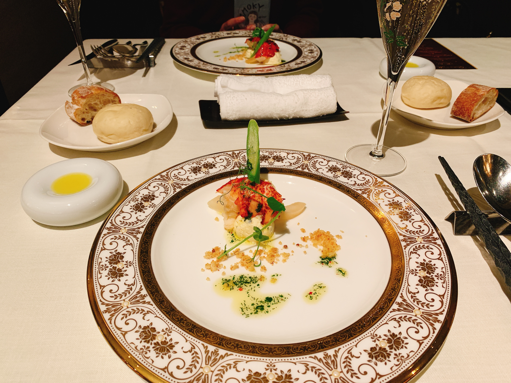

この記事にはポエム成分が多く含まれております、ご注意ください😔

どうも、hpp([@hpp_ricecake](https://twitter.com/hpp_ricecake))です。年末の振り返り的な行事をやったことがあまりないのですが、せっかくブログを作っていたので、重い腰を上げて振り返り記事なるものを書いてみようと思います。

今年はいろいろ手を出していた気がするので、一介の大学生なりに頑張った(たぶん頑張っていた)、その記録を残せたらと思います。しかしながら記憶が全然残っていないので、年の始まりから順に思い出してみようと思います。

あ、まってください、ご飯に呼ばれました(実家住み)、夕食を食べてきます。

帰ってきました。ごちそうさまでした。

はじめます。

# 1月

主に React(Gatsby.js), TypeScript で何かしていました。あとブログを作っていました。といっても、開発していたのはいまみなさんが見ているこのブログではなくて、デザインがうるさすぎて気に入らず、既に捨てられた方のブログです。↓

<blockquote class="twitter-tweet mb-8" data-dnt="true" align="center">
設定間違えた <a href="https://t.co/SQgTSkAMoH">pic.twitter.com/SQgTSkAMoH</a>
&mdash; hpp (@hpp_ricecake) <a href="https://twitter.com/hpp_ricecake/status/1216450299038064640?ref_src=twsrc%5Etfw">January 12, 2020</a></blockquote>

それと、名古屋合同懇親会(NGK2020s)というものに参加させていただいて、Gatsby についての LT をやりました。

[今年もやる](https://ngk2021s.connpass.com/event/199017/)ようなので、名古屋周辺にお住みの方は申し込んでみるといいじゃないでしょうか。

このころは Gatsby.js にハマっていていろいろやっていた気がしますが、やったことは全部捨てた気もします。

他には、大学の実験([Pascal のサブセット言語のコンパイラを作るやつ](https://github.com/hppRC/CSE3))がかなり楽しかったのと、3年の他の学期に比べると課題が少なくて楽な学期だった記憶があります。でも講義は大体寝ていました🤔

人間の話を聞くのは難しいですね。人間とお喋りならできるんですが、不思議です。

# 2月

たくさん V を見ていました。

<blockquote class="twitter-tweet" data-dnt="true" align="center">
本日のキャサリンママ<a href="https://twitter.com/hashtag/%E3%83%95%E3%83%96%E3%82%ADch?src=hash&amp;ref_src=twsrc%5Etfw">#フブキch</a> <a href="https://twitter.com/hashtag/%E7%B5%B5%E3%83%95%E3%83%96%E3%82%AD?src=hash&amp;ref_src=twsrc%5Etfw">#絵フブキ</a> <a href="https://t.co/yoOuQN6988">pic.twitter.com/yoOuQN6988</a>
&mdash; hpp (@hpp_ricecake) <a href="https://twitter.com/hpp_ricecake/status/1227626277697253377?ref_src=twsrc%5Etfw">February 12, 2020</a></blockquote>

それ以外だと、期末テストがありました。無事単位を落とさずに学期を終えることができたので、結構よかったんじゃないかと思います。

この学期の前の、第3クォーター(弊学部はクォーター制)でデータベースに関する講義の単位を落としかけたので、ちゃんと勉強したことを覚えています。どうやら勉強は真面目にやるといいらしいです。

それと、ふだんは地元のエイチームという会社でエンジニアのバイトをしていました。Vue と Rails をかじっていました。

その他には、N-ISUCON というパフォーマンスチューニングのイベントに運良く(抽選があった)参加できることになったので、同じ大学の人と3人チームで参加してきました。

<blockquote class="twitter-tweet" data-dnt="true" align="center">
対戦よろしくお願いします！ <a href="https://t.co/Xqz6FeVEMl">pic.twitter.com/Xqz6FeVEMl</a>
&mdash; hpp (@hpp_ricecake) <a href="https://twitter.com/hpp_ricecake/status/1228848914553397248?ref_src=twsrc%5Etfw">February 16, 2020</a></blockquote>

成績は 10 チーム中 3位でした、コードを眺めていたらチームメイトがガーッと改善してくれました。僕はお茶をしっぽり飲んでいた記憶があります。

traP の方のチームがめちゃくちゃ強かったことを覚えています(1, 2, 4 位が traP の人だった気がする)。

4位のチームの方とは、3月のインターンで再びエンカするという巡り合わせがありました。人間っていろんな場所にいて面白いですね。

# 3月

CyberAgent さんの CA Tech Job というインターンに参加させていただきました。このインターンは僕の転機とも言えるものになりました。

というのも、それまで技術的に優れた方に師事する機会というものがなかったので、メンターの方にタスクに関するわからないことや業務内外の技術の話、web 技術全般に関する話や思いっきり趣味の話など、自分の知らない世界を教えていただく初めての経験になったからです。超楽しかった。

メンターの方はもちろん、困ったら常に相談に乗ってくれた同じチームの方も、焼肉をご一緒した他の部署の方も、すべて記憶に残っています(業務外のボルダリングも)。

一方で、業務内容的には、もっと多くのことを、もっと質を上げてやっていきたかったという気持ちがあります。自分の技術力その他もろもろの不足を感じました。
もっと技術力あげたいですね。

成長した姿をいつか見せられたらと思います。がんばるぞ！！

<blockquote class="twitter-tweet" data-dnt="true" align="center">
CAでのインターン、社会情勢も踏まえ本日で終了と相成りました！ 最後数日出来なかったのは残念だったけど、めちゃくちゃ楽しかったので満足！！！！！！！ また参加しにきます、ありがとうございました！！！！！！！！！！ <a href="https://t.co/6GEYlP490o">pic.twitter.com/6GEYlP490o</a>
&mdash; hpp (@hpp_ricecake) <a href="https://twitter.com/hpp_ricecake/status/1243184983058964480?ref_src=twsrc%5Etfw">March 26, 2020</a></blockquote>

というわけで、タイトルの桜はこのインターンの最終日に撮ったものなのでした。ボルダリング帰り。

あと研究室配属の振り分けが進んでいました。

Google Spraed Sheed に希望研究室を書くという方式だったのですが、合理的だが味気ないみたいな３分の1の純情な感情というお心持ち。

心理戦が発生していて、心臓によろしくないな〜と思いながらスプシを眺めていました。どこの大学も研究室配属の駆け引きみたいなもの、あると思います。うちの学科は GPA が高い方が勝つ仕組みだったので、さながらアフリカオオコノハズクのような威嚇合戦が起こっていたことでしょう。

# 4月

研究室配属されました。うちの大学は 4年次からです。

自然言語処理を専門にやっている研究室です。研究室選びのポイントとして「ちゃんと研究ができる」というのを重視していました。

画像系の研究室と音響信号処理の研究室、データベースの研究室もあって迷ったのですが、僕が配属された研究室にもともとお世話になっていた先輩がおり、しっかり研究できる雰囲気を聞いていたので、ほぼ一択の状況でした。この判断は間違っていなかったと思います。

4月中は研究テーマ探しをのんびりしていたらいつの間にか終わっていました🤔

誕生日プレゼントに AirPods pro をもらってめちゃくちゃ嬉しかった、という思い出があります(愛用してる)。

そういえば TOEFL iBT があったので受験しました。72点でした。は？

そういえば水色になって放置してた AtCoder に復帰しました。緑色に落ちました。は？

月末に cookpad さんの 1day インターン的なものに参加して、gRPC のお勉強をしました。でも使えるようになった気はしない。

# 5月

記憶がない...今年って5月ありましたっけ?

院試勉強しなきゃな〜と思いながら研究テーマについて考えていて、大筋が決まったくらいでしょうか。
うちの研究室では、研究テーマは所与のものではなく自分でやりたいことを考える感じなので、テーマ探しも結構大変でした。

でも、やりたいことをやらせてくれて、その取り組みにその道のプロがフォローをくれる環境、考えてみるとかなりすごいので、ありがたく享受するとよさそうです。

それと、6月にうじまる([@uzimaru0000](https://twitter.com/uzimaru0000))くんの誕生日 LT 会が生えたので、その準備をしていました。

身内のLT会ってなんかいいですよね、存在から面白いので。

そういえばここらへんで、Git/GitHub を使いはじめて 1年が経っていました。毎日の活動履歴が残っているのはいい気持ちになりますね。多分日記とかも書けば達成感が残ると思うのですが、めんどくさがりなので厳しい目標です。

# 6月

うじまるくんの誕生日をお祝いしました、おめ！！
どの発表も面白かったですが、僕はこんなのを喋りました。

<iframe loading="lazy" src="https://speakerdeck.com/player/7ed08c25391f4b2991fbda94b052319c" style=" position: absolute; top: 0; left: 0; width: 100%; height: 100%;border: 0;" allowfullscreen scrolling="no" allow="encrypted-media"></iframe>

そんな感じです、現在も稼働中のうぢまる([@ujimaru0000](https://twitter.com/ujimaru0000))くんをよろしくお願いいたします。
名文検索用のクエリは[こちら](https://twitter.com/search?q=from%3A%40ujimaru0000%20min_faves%3A5&src=typed_query)。

会の後の雑談も本質で非常によかったです、身内LT会マジでおすすめ。

最初は深層学習ベースのモデルを作ろうと思っていたのですが、ゼロからやるにはデータが足りなくて諦めました。諦めた履歴もスライドに残していると思うので、興味がある方は見てみてください。

その他には、先行研究を漁ったり、論文を読んだりしていた気がします。あとは、あいも変わらず無限に V を見ていました。

<blockquote class="twitter-tweet" data-dnt="true" align="center">
先行研究 <a href="https://t.co/e2TFB5VsAR">pic.twitter.com/e2TFB5VsAR</a>
&mdash; hpp (@hpp_ricecake) <a href="https://twitter.com/hpp_ricecake/status/1275738005051813891?ref_src=twsrc%5Etfw">June 24, 2020</a></blockquote>

それと CyberAgent 社の backend tuning competition に参加して優勝することができました。技術的なイベントで目立った成績を残したことがなかったので、とっても嬉しかったです。

あ！iPad pro を買いました。嬉しいですね。嬉しいと言いなさい。

そういえば、ですが、大学最後のテストが終わりました。単位を無事取り切れているといいですね。

# 7月

7月はちょくちょく趣味の開発をしつつ、先行研究の再現実装をしていました。直接いまの研究に使っているわけではないですが、基本的な PyTorch のお勉強はできました。

でも 6500行の Python コードを読むのは疲れました、めちゃくちゃ綺麗なコードでも疲れると思うので、況や研究用のコードをやという感じです。

いつだったか忘れましたが、リクルートのインターンに DS 系で申し込んでいて、それに落ちた連絡がここらへんで来た気がします。かなしいね。

他にも各種インターンに申し込んでいましたが、院試の日程が不明瞭だったので、選考に通過したところにも行くことができませんでした。かなしいですね。

7月マジで書くことがなくて笑っているのですが、たぶん先行研究の再現実装に苦しみすぎて野垂れていたからだと思います。ほかには...奨学金の書類とかやっていたかな？院試勉強という「やらなければいけないこと」がある状況で、他の何かをやる気が起こらなくて、でも院試勉強もやる気がない、みたいな精神状態でした。こういう時は寝ましょう。寝ろ。

# 8月

にじさんじ甲子園をずっと見ていました。院試勉強は？

<iframe loading="lazy" src="https://www.youtube.com/embed/i55GH7l4Y0I?rel=0" style=" position: absolute; top: 0; left: 0; width: 100%; height: 100%;border: 0;" allowfullscreen scrolling="no" allow="encrypted-media; accelerometer; clipboard-write; gyroscope; picture-in-picture"></iframe>

うちの院は内部生の推薦とか院試免除とか、ストレートに上がる人に対する有利な制度とかが無いので、外部の人と普通に真剣勝負をしなければいけません。大変ですね。

研究室がアレだったら東大や京大の院、NAIST を受験することも考えていましたが、環境が(指導教員やメンバーを含めて)最高だったので、特に外部受験は考えていませんでした(5月前後の話)。

というわけで、受験勉強は名古屋大学大学院の分しかしていません。もしうちの院に興味がある方がいれば、Twitter で DM を送ってくれれば相談乗ります(うちの研究室はいいぞ！！)。

大学院入試は情報戦の色が強い気がするので、うちに限らず大学院進学を考えている人は、早めに調べ物をしておくといいんじゃないでしょうか。自分は~~自然言語処理(Natural Language Processing: NLP)のことしかわかりませんが~~何もわかりませんが、NLP のおすすめ研究室とかだったら話せる気がします。

院試勉強もなんやかんや言いつつ基礎の復習になったので、よかったと思います。もう一回やりたいかと言われるとノーです。

そういえば 6月末に受けたテストの成績が出ていました。無事単位を取れていたので、大学生活で一度も単位を落とすことなく卒業に必要な単位を揃えることができました。最終的な GPA は 3.89/4.30 でした。もうちょっと真面目に勉強していれば 4.0 に乗ったかもしれないですね。

# 9月

院試本番がありました！今年は流行病の影響もあって、なんと試験が口頭試問だけになりました(~~運ゲーじゃん~~)。

試験自体の公開とかはできないですが、内容自体はちゃんと勉強していないと解けないやつと、コードをちゃんと書いてる人じゃないとわからないものが存在していました。もしかしたら来年も口頭試問だけかもしれないですね。大学側も大変だと思うけど頑張ってほしいという気持ち。

なんやかんややってるうちに大学院入試の合格通知が来ました。口頭試問の出来がよかった自信があったのでそんなに焦ってはいなかったですが、結構ドキドキしました。どうやらもとの倍率は3倍くらいあったらしいですが、合格者がめちゃくちゃいたので実質倍率1.8倍とかだったと思います。そんなに合格者出して、受け入れ先があるのか...？

院試終わった後は絵を書いたりコードを書いたりしていました。このブログを作ったのも 9月だったと思います。スッキリしたやつが欲しくて。

あと、この時期は研究含めていろいろ勉強していた気がします。Variational Auto Encoder(VAE) に興味が出てきて、変分推論法のあたりから全体的にいろいろ調べていました。生成系の話はやっぱり面白いので、主研究領域にするかはわかりませんが、コツコツ勉強していきたいですね。

なんか機会があれば輪講で喋った VAEのまとめスライドを再編集して投下しておきます。結構頑張ってまとめました。

あと 1Password を導入してました、非常に体験がいいサービスで、サブスクする価値があると思います。2要素認証での連携も相性バッチリで最高という気持ちです。

# 10月

この月はやっぱり研究に関する勉強をしていました。それと、卒研のテーマをちょっと修正していました。より面白くなるといいね。

あと京都の学生コミュニティであるところの CAMPHOR- さんで、[インターン報告大会](https://camphor.connpass.com/event/189734/?utm_campaign=event_participate_to_follower&utm_source=notifications&utm_medium=twitter)というイベントがあったので、Twitter で仲良くしている人たちとのエンカ目的で出会い厨をしに京都にお邪魔しました。人間、いろんな場所でいろんなことをやっているので、面白いですね。

<blockquote class="twitter-tweet" data-dnt="true" align="center">
京都訪問のシメわよ <a href="https://t.co/ySp7H2zPuY">pic.twitter.com/ySp7H2zPuY</a>
&mdash; hpp (@hpp_ricecake) <a href="https://twitter.com/hpp_ricecake/status/1315252276756242432?ref_src=twsrc%5Etfw">October 11, 2020</a></blockquote>

それと、研究用の Python ライブラリを書いたりもしていました(自前のスクリプトを雑に移植しただけ)。

適当にやってもいい感じに実験を slack に流してくれるので便利。多分。名前は Calliope Mori リスペクトです、もちろん。

ここらへんから頻繁に指導教員や研究室のメンバーと相談をするようになっていって、研究オモシレー感が強くなっていきました。卒業できるといいね。

他には、弊学のスパコンハッカソンに参加していました。内容としては、うちの大学のスパコンの普及を促進しよう！みたいな感じで、無料でクソ強 GPU環境が使えるよ、という感じでした。特に課題が与えられるわけではなく、自分で好きなことをやっていいよ！という雰囲気です。

僕は同じ研究室の人とチームで参加して、BERT の事前訓練用コードを自前で書いていました。最初は GPT-2 の事前訓練を回そうとしていたのですが、スパコン環境でも数日では終わらない感じだったので諦めて、日本語 BERT を訓練するための環境を整えるあたりに注力しました。

普段 BERT など事前訓練済みモデルを扱う際は、fine-tuning 的な用途が主体だと思うので、一から書いていく(といってもモデルのアーキテクチャ自体は huggingface/transformers の BERT を流用)のは新鮮でよかったです。

めちゃくちゃ余談ですが、糖質制限ダイエットを(先輩に影響されて)はじめました。10月頭の時点で 74.4kg あった体重はどこまで落ちるのでしょうか。

# 11月

ずっと研究していたので、特に面白いことを言えない気がします🤔 なんとか卒業できそうな実験結果が出たのがこの月でした。

強いて言えば、論文についての記事を書いていたり(自由に働けるのでとってもおすすめバイトです)、

<blockquote class="twitter-tweet" data-dnt="true" align="center">
自然言語処理においてBERTは素晴らしい性能を発揮してきましたが、文はどう埋め込むのが正解なのでしょうか。今回ご紹介するSBERT-WKはBERTの性質を生かしてよりよい文ベクトルを作ろうとする試みです。是非ご覧ください！ <a href="https://t.co/AWQuDF9ucO">https://t.co/AWQuDF9ucO</a>
&mdash; AI技術最新情報メディア | AI-SCHOLAR (@ai_scholar) <a href="https://twitter.com/ai_scholar/status/1329620855286992896?ref_src=twsrc%5Etfw">November 20, 2020</a></blockquote>

あとは[ぷらすくんの生誕LT会](https://connpass.com/event/193445/?utm_campaign=event_participate_to_follower&utm_source=notifications&utm_medium=twitter)をやっていました。誕生日恒例企画、大変いい感じ。

僕は[特設サイト](https://nama-tamago.github.io/p1ass-lt-site/)の開発を担当しました(iframe タグで雑に埋め込めるのめっちゃいいですね)。

<iframe loading="lazy" src="https://nama-tamago.github.io/p1ass-lt-site/" style=" position: absolute; top: 0; left: 0; width: 100%; height: 100%;border: 0;" allowfullscreen scrolling="no" allow="encrypted-media"></iframe>

それと、LT会当日はこんなことを発表しました。react-three-fiber という React.js で WebGL と Three.js をいい感じにするライブラリの紹介がメインです🤔

<iframe loading="lazy" src="https://speakerdeck.com/player/09e708e56f6340bfa54224b198d6a98e" style=" position: absolute; top: 0; left: 0; width: 100%; height: 100%;border: 0;" allowfullscreen scrolling="no" allow="encrypted-media"></iframe>

WebGL を触ること自体が久しぶりだったのでいろいろ迷っちゃいましたが、割と見た目に面白いサイトを作れたんじゃないかという気がします。

この時期はたまに研究室に行って相談しながら研究をして、帰りにラーメンを啜るという生活をしていました(糖質制限ダイエットは？)。

それとこの月はディスプレイを買いました、デュアルディスプレイ最高！という気持ちです。早速もう 1,2枚欲しくなっています。

<blockquote class="twitter-tweet" data-dnt="true" align="center">
my ney gear… <a href="https://t.co/t5ruSSKpZO">pic.twitter.com/t5ruSSKpZO</a>
&mdash; hpp (@hpp_ricecake) <a href="https://twitter.com/hpp_ricecake/status/1326835477949788161?ref_src=twsrc%5Etfw">November 12, 2020</a></blockquote>

ディスプレイに関する意見を募ったら、実感を伴う言葉をたくさんいただいたので、参考までに貼っておきます。

<blockquote class="twitter-tweet" data-dnt="true" align="center">
ディスプレイを買いたい、オススメがある方いれば教えてください  現状: - 主機: MacBook Pro 16 インチ - サブディスプレイなし - 机ちょっと狭い
&mdash; hpp (@hpp_ricecake) <a href="https://twitter.com/hpp_ricecake/status/1313411765485490176?ref_src=twsrc%5Etfw">October 6, 2020</a></blockquote>

# 12月

自然言語処理の国内学会として、言語処理学会というものがあります。うちの研究室は、いい感じの成果が出たら論文書ける人は書こうねという雰囲気なのですが、自分は結構書きたい気持ちが強かったので、頑張って締め切りに間に合うように研究を進めていました。Publication 、してみたいよね(フワッとした気持ち)。

卒論も書かなきゃなのですが、なんか今年やった実験を書き殴るだけでどうにかなりそう(雑な推定)なので、言語処理学会のことしか考えていませんでした。自分は論理的思考が得意ではないので、指導教員の方や同期、先輩ににいろいろ突っ込んでもらいながら、自分でも頭を回していろいろ頑張った気がします(ほんまか？)。

というわけで、12月は言語処理学会に向けていろいろ実験を回していて、深層学習モデル特有の何かに悩まされたりしながら考察を進めていました。

<blockquote class="twitter-tweet" data-dnt="true" align="center">
なんだァ？てめェ...... <a href="https://t.co/oHp14dkzEx">pic.twitter.com/oHp14dkzEx</a>
&mdash; hpp (@hpp_ricecake) <a href="https://twitter.com/hpp_ricecake/status/1342096267116048384?ref_src=twsrc%5Etfw">December 24, 2020</a></blockquote>

そういえば10月から申し込んでいた(そしてコーディングテストでやらかした)、某インターンの合格通知が来ました。非常に興味のある部署だったのでとっても嬉しかったです。成果が残せないんじゃないかと思って怖くなっちゃうんですが、そこは頑張りどころというやつなのでしょう。頑張ります(ところで卒論と日程が若干かぶっていて死にそうな気がします)。

あと 10月に受けて、落ちたと思って忘却していた DBスペシャリスト試験に合格しました。IPA の資格は AP と合わせて二つ目です。ギリギリで合格してしまったので複雑な気持ち。スペシャリストというか、たぶんアマチュアくらいです。

<blockquote class="twitter-tweet" data-dnt="true" align="center">
筆記がマジでギリギリだけどDBスペシャリスト合格した🤔 <a href="https://t.co/heV8gNfYjE">pic.twitter.com/heV8gNfYjE</a>
&mdash; hpp (@hpp_ricecake) <a href="https://twitter.com/hpp_ricecake/status/1342312023242067968?ref_src=twsrc%5Etfw">December 25, 2020</a></blockquote>

~~勉強はしっかりしろとあれほど。~~

応用情報はわかりませんが、DB はとても試験が難しく、実用に則している(のか？)と思ったので、興味がある方は受けてみるといいと思います。

クリスマスはダウンとシャツをプレゼントしてもらったり、ディナーに行ったりしました。とっても楽しかった。

糖質制限ダイエットの結果ですが、12月末の時点で 74.4kg -> 66.6kg になりました。8kg くらい落ちましたね。BMI が 20くらいに戻ってきたので、これを維持すればいいんじゃないでしょうか(罪悪感なくラーメンが食えるぞ！)。

糖質制限、ナッツとサラダチキンとチーズをかじっていれば勝手に痩せるのでかなり楽です。運動はやる気が起こらない(よくない)ですが、これは続けられそう。無理にやると筋肉削れて代謝が悪くなるので、栄養はちゃんと意識して摂るようにしましょう。

あと、肌がめちゃくちゃ荒れたので皮膚科でステロイドの薬をもらって塗ったらめちゃくちゃ改善しました。ステロイドって抗生物質の類かと勘違いしていたのですが、免疫機能を抑制して炎症を抑える感じの薬なんですね。塗りたくってます。

# おわりに

そんなこんなで年末です。いまはお尻に火を付けつつ言語処理学会用の論文の構成を練っているところです(~~振り返りブログとか書いている場合ではない~~)。

2021年の抱負、ちゃんとしたものはまた機会があれば書こうと思います。雑にメモっておくと、

- ちゃんとブログを書く(10本以上)
- ちゃんと論文を書く(2本以上？)
- ちゃんと働く(インターンとか探しています)

研究が思ったより楽しくて、最近は日中ずっと(夜中も)研究をしています。研究室運がよかったですね。

言語処理学会に発表する内容を、ブラッシュアップして国際学会にも投げたいなと思っています。もちろん面白い結果だと自信を持って言い切ることができればですが。並行して測度論に関する本や PRML を読んで、地力を上げていきたい気持ちがあります。いい研究をするために、数学的な素養を身につけておきたいですね。

忘れていましたが、英語もやりましょう。喋れない。[サメちゃん](https://www.youtube.com/channel/UCoSrY_IQQVpmIRZ9Xf-y93g)の配信を聞くだけで満足してはいけない。

今年は自分にとって節目になる年だったかなと思います。僕の知らないいろいろな世界を、本当にいろいろな立場の人から教えてもらいました。夜な夜な麻雀に付き合ってくれる友人にも感謝です。

また、同じ大学の友人の凄さも改めて感じました。僕の友人は競技プログラミングに真摯に取り組んでいる子が多くて、その姿勢をすごく尊敬しています(僕はフワッフワしがちなので...)。

あと、自分はどうやら 23卒なのでそろそろ就活がチラついてきているらしく、来年は自分の進路が決まる年になるかもしれません(D進するにしろ就職するにしろ)。あんまり実感はないですが、楽しくやれる方向にいけるといいなと思います。まだまだ未熟なのでちゃんと勉強して力をつけていきたいですね。

それと、隙を見て V のファンサイトを作りたいなと思っています。[以前カンプだけ作って放置してしまっているサイト](https://lulu-suzuhara-fansite.netlify.app/)があるんですが、ここらへんをちゃんと WebGL や CSS 使っていい感じのインタラクションつけて世に送り出したい。V の文化にもらってばかりでは気が済まないですし🤔

あ、絵も描きたいです。以前流れてきたこの記事に感銘を受けて、絵を描きたい気持ちが急上昇中です。

M1 の年は学位論文が遠いこともあって若干プレッシャーが薄めだと思うので、研究をガリガリしながら、息抜きに絵を描いたりコードを書いたりできればいいんじゃなかなと思います。流行病にも気をつけましょう。

皆様、本年は大変お世話になりました。2021年もどうぞよろしくお願いいたします。
